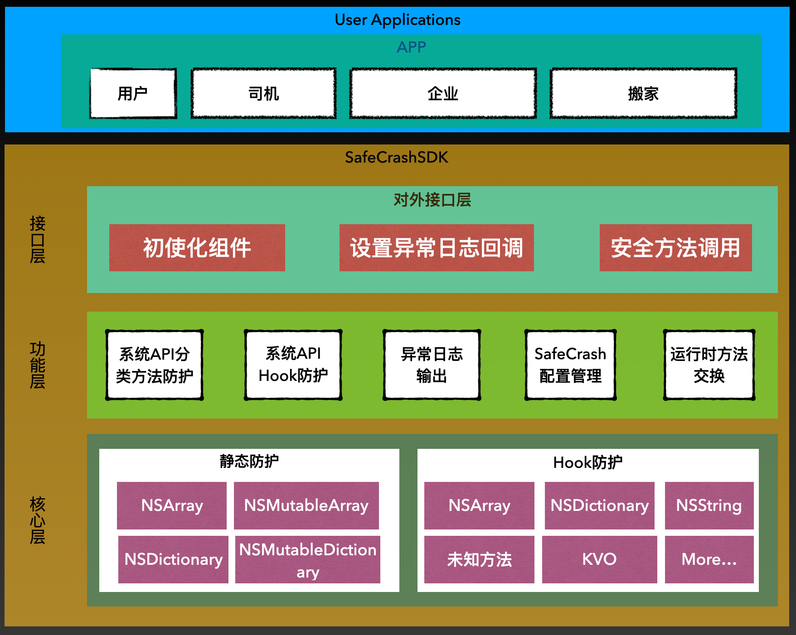
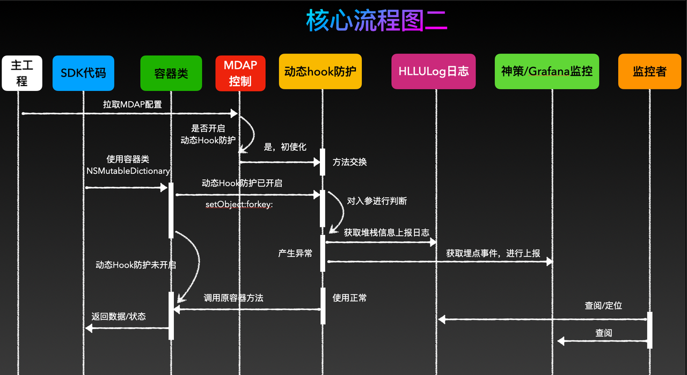
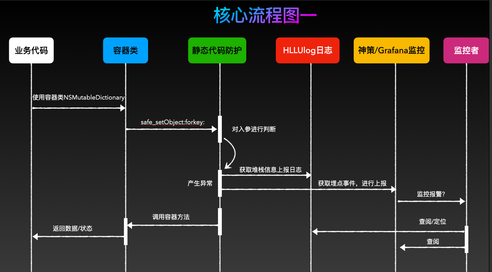
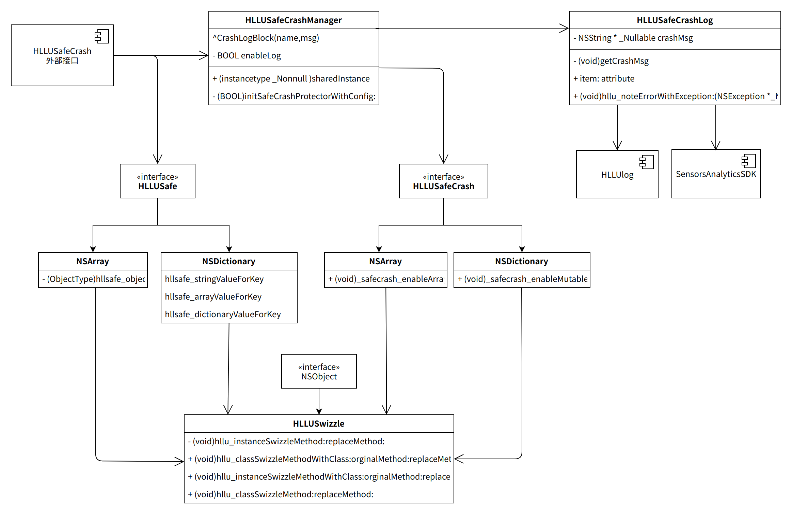
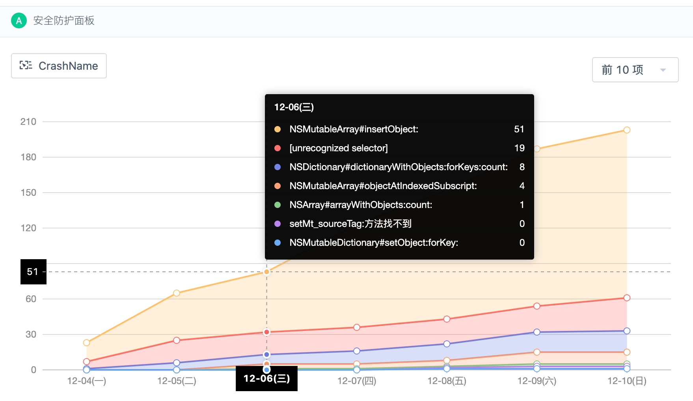

<h1 align="center">

</h1>

[](https://github.com/HuolalaTech/HLLSafetyAirBag)
[](https://raw.githubusercontent.com/HuolalaTech/Glog/master/LICENSE) 
[](https://github.com/HuolalaTech/Glog/pulls) 
[](https://github.com/HuolalaTech/Glog/wiki)

---

> HLLSafetyAirBag:  意即安全气囊,为您保驾护航. Create By Sherwin.Chen


## 背景
  - HLL相关的二方库，崩溃占大头的为容器类的使用不当造成的，而这块用户组没法去参加代码的CR来保证质量，那我们需要一种机制来保证即使二方库错误的使用容器类，也不会让APP直接闪退，以达到我们控制崩溃率的目的。
- 业务代码的崩溃占比虽然少，但为了更安全的使用容器类，我们可以设计一种安全访问容器类的机制，即使错误的使用了，也不会触发底层容器类的调用，从而保护了上层业务代码。
- 虽然我们提供了崩溃时的安全防护，但我们也需要把产生的问题收集汇总，通过二方库以及业务开发同学处理这样的异常问题，那么我们需要一种能够收集异常的后台服务，最好还能通过监控面板直观的监控异常情况.

## Features
  1. 主动安全防护
  2. 被动安全防护
  3. 防护项可参数配置开关
  4. 防护发生时，提供详细的堆栈
  5. 详细的日志结构，可上报神策、bugly等监控平台


## 整体设计思路

###架构设计



1. 业务层对调用iOS系统库方法进行适配层防护 
2. SDK层调用iOS系统库方法做runtime的Crash防护
3. Crash防护时上报Crash日志,用于警报以及Crash定位
4. Crash防护时上报异常名到神策，通过实时监控平台展示异常图表
5. 由mdap平台下发防护开关，分一级二级开关
6. Debug模式下让crash正常崩溃，弹出提示信息。

### 静态代码防护时序图


### 运行时Hook代码防护时序图


### 类图设计


### 神策监控面板


## 使用介绍

## 如何集成使用

### [CocoaPods](https://cocoapods.org)
Add the following entry in your Podfile:

```ruby
   pod 'HLLSafetyAirBag', '1.1.3'
```

# HLLSafetyAirBag 使用方式

## 被动防护使用方式
1.  ### 参数配置

 鉴于已经实现了自动注册能力，开发者无需自己添加路由，只需要进行如下操作即可

```Objective-C
//1. 初使化配置数据. 可以从下发配置中读取. 首次可使用缓存机制.
    NSDictionary *info = @{
        @"enable" : @1,         //安全气囊总开关, 如果为0, module_map下的防护将不会开启.
        @"version": @"0.1.0",   //当前配置数据版本号，非必须
        @"time" : @"2021-06-10",//当前配置数据的时间,非必须
        @"module_map": @{
           @"NSArray"        : @{@"enable":@1}, //NSArray防护开关
           @"NSMutableArray" : @{@"enable":@1}, //NSMutableArray防护开关
           @"NSDictionary"   : @{@"enable":@1}, //NSDictionary防护开关
           @"NSMutableDictionary" : @{@"enable":@1}, //NSMutableDictionary防护开关
           @"NSAttributedString" : @{@"enable":@1}, //NSAttributedString防护开关
           @"NSMutableAttributedString" : @{@"enable":@1}, //NSMutableAttributedString防护开关
           @"UnrecognizedSelector" : @{@"enable":@1,@"defendClass":@[@"HLLMeVC",@"HLLSetingVC",@"HLLViewController"]}
           }
    };
```
   - 配置下发可通过后台接口，也可通过专门的配置SDK下发，不支持运行时，再动态更换.
   - 之所以通过NSDictionary字典做为配置对象，是方便后续的扩展

1.  ### 注册
```Objective-C
[HLLUSafeCrashManager.sharedInstance initWithAppId:@"com.huolala.user"
                                         enableLog:YES];
```
- 开启注册(内部细节已砍掉,可自己补充)
- enableLog: 设置调试运行日志开关输出.


3.  ### 初使化，设置回调
```Objective-C
//传入配置参数,启动防护组件
    [HLLUSafeCrashManager.sharedInstance startSafeCrashProtectorWithConfig:info
                                                             crashCallBack:^(NSString * _Nonnull crashName, 
                                                                             NSString * _Nonnull crashMsg,
                                                                             NSException * _Nonnull exception) {
        
        NSLog(@">>>> \ncrashName:%@  \ncrashMsg:%@  \nexception:  %@",crashName, crashMsg,exception);
        
        /**bugly上报
         上报自定义Objective-C异常
         */
        [Bugly reportException:exception];
        
        //实时日志上报
        //LogW(@"");
        
        //神策上报
        /*
        [[SensorsAnalyticsSDK sharedInstance] track:@"SafetyAirBag"
                                     withProperties:@{
             @"crashName":crashName
             @"crashMsg" :crashMsg
         }];
         */
    }];
```

4. ### 静态主动防护示例
```Objective-C
    NSString *nullObj = nil;
    NSMutableArray *ary = [[NSMutableArray alloc] init];
    [ary hllsafe_addObject:nullObj]; //加入空对象
    [ary hllsafe_objectAtIndex:NSNotFound]; //获取越界对象
    
    NSMutableDictionary *dic = [[NSMutableDictionary alloc] init];
    [dic hllsafe_boolValueForKey:nullObj];
    [dic hllsafe_setObject:nullObj forKey:@"TestKey"];
    [dic hllsafe_dictionaryValueForKey:nullObj];
    //......Value: ForKey:
    return;
```

## IV. AUTHOR
[货拉拉技术](https://juejin.cn/user/1768489241815070)


## V. LICENSE
-------

```
Copyright 2022 Huolala, Inc.

Licensed under the Apache License, Version 2.0 (the "License");
you may not use this file except in compliance with the License.
You may obtain a copy of the License at

   http://www.apache.org/licenses/LICENSE-2.0

Unless required by applicable law or agreed to in writing, software
distributed under the License is distributed on an "AS IS" BASIS,
WITHOUT WARRANTIES OR CONDITIONS OF ANY KIND, either express or implied.
See the License for the specific language governing permissions and
limitations under the License.
```