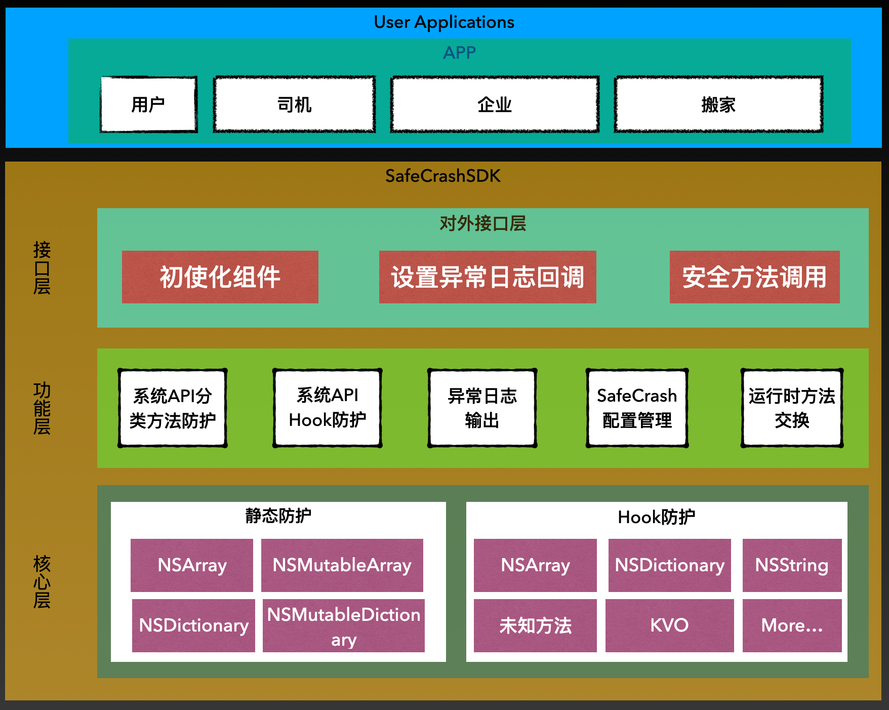
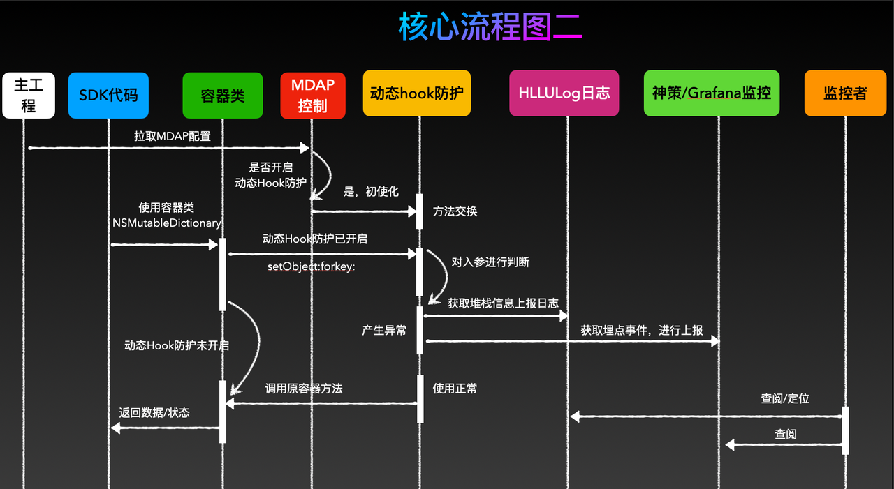
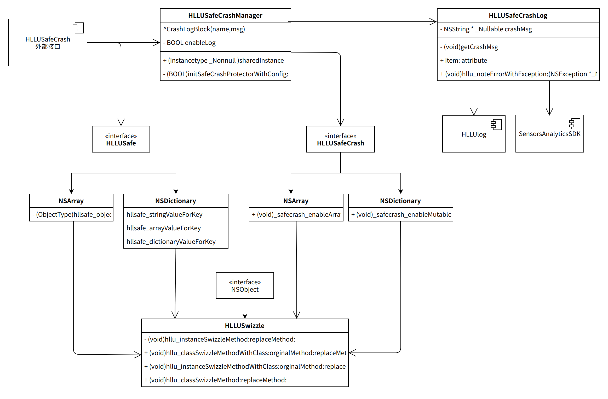

<h1 align="center">

</h1>

[](https://github.com/HuolalaTech/HLLSafetyAirBag)
[](https://raw.githubusercontent.com/HuolalaTech/Glog/master/LICENSE) 
[](https://github.com/HuolalaTech/Glog/pulls) 
[](https://github.com/HuolalaTech/Glog/wiki)

> [中文文档](README-zh.md)

---

> HLLSafetyAirBag: means safety airbag to protect you. Create By Sherwin.Chen


## Background
- Most of the crashes of HLL-related second-party libraries are caused by improper use of container classes, and this user group cannot participate in code CR to ensure quality, so we need a mechanism to ensure that even if the second-party library is wrong The use of container classes will not cause the APP to crash directly, so as to achieve our purpose of controlling the crash rate.
- Although the proportion of business code crashes is small, in order to use container classes more safely, we can design a mechanism to safely access container classes. Even if it is used incorrectly, it will not trigger the call of the underlying container class, thereby protecting Upper-layer business code.
- Although we provide security protection when crashing, we also need to collect and summarize the problems that occur, and deal with such abnormal problems through second-party libraries and business development students. Then we need a background service that can collect exceptions, preferably Abnormalities can also be intuitively monitored through the monitoring panel.

## Features
   1. Active security protection
   2. Passive safety protection
   3. Protection items can be configured with parameters.
   4. Provide detailed stack when protection occurs
   5. Detailed log structure can be reported to monitoring platforms such as Shence and bugly.


## Overall design ideas

###Architectural design



1. The business layer implements adaptation layer protection for calling iOS system library methods
2. The SDK layer calls the iOS system library method for runtime crash protection.
3. Crash logs are reported during crash protection for alarms and crash location.
4. During crash protection, abnormal names are reported to Shence, and abnormal charts are displayed through the real-time monitoring platform.
5. The mdap platform issues protection switches, which are divided into first-level and second-level switches.
6. Let the crash crash normally in Debug mode and a prompt message will pop up.

### Static code protection timing diagram


### Runtime Hook code protection timing diagram


### Class diagram design


### Shence Monitoring Panel


## Introduction to use

## How to integrate and use

### [CocoaPods](https://cocoapods.org)
Add the following entry in your Podfile:

```ruby
   pod 'HLLSafetyAirBag', '1.1.3'
```

#HLLSaftyAirBag How to use

## How to use passive protection
### 1. Parameter configuration

```Objective-C
//1. Initialize configuration data. It can be read from the delivered configuration. The caching mechanism can be used for the first time.
     NSDictionary *info = @{
         @"enable": @1, //Airbag master switch, if it is 0, the protection under module_map will not be turned on.
         @"version": @"0.1.0", //Current configuration data version number, optional
         @"time": @"2021-06-10", //The time of the current configuration data, optional
         @"module_map": @{
            @"NSArray" : @{@"enable":@1}, //NSArray protection switch
            @"NSMutableArray" : @{@"enable":@1}, //NSMutableArray protection switch
            @"NSDictionary" : @{@"enable":@1}, //NSDictionary protection switch
            @"NSMutableDictionary" : @{@"enable":@1}, //NSMutableDictionary protection switch
            @"NSAttributedString" : @{@"enable":@1}, //NSAttributedString protection switch
            @"NSMutableAttributedString" : @{@"enable":@1}, //NSMutableAttributedString protection switch
            @"UnrecognizedSelector" : @{@"enable":@1,@"defendClass":@[@"HLLMeVC",@"HLLSetingVC",@"HLLViewController"]}
            }
     };
```
    - Configuration can be delivered through the background interface or through a special configuration SDK. It does not support dynamic replacement during runtime.
    - The reason why NSDictionary dictionary is used as the configuration object is to facilitate subsequent expansion.

### 2. Registration service
```Objective-C
[HLLUSafeCrashManager.sharedInstance initWithAppId:@"com.huolala.user"
                                         enableLog:YES];
```
- Open registration (internal details have been cut off, you can add them yourself)
- enableLog: Set the debug run log switch output.


### 3. Initialization, set callback
```Objective-C
//Pass in the configuration parameters and start the protection component
    [HLLUSafeCrashManager.sharedInstance startSafeCrashProtectorWithConfig:info
                                                             crashCallBack:^(NSString * _Nonnull crashName, 
                                                                             NSString * _Nonnull crashMsg,
                                                                             NSException * _Nonnull exception) {
        
        NSLog(@">>>> \ncrashName:%@  \ncrashMsg:%@  \nexception:  %@",crashName, crashMsg,exception);
        
        /**Report bugly
          Report custom Objective-C exceptions
          */
         [Bugly reportException:exception];
        
         //Real-time log reporting
         //LogW(@"");
        
         //SensorsAnalyticsSDK report
        /*
        [[SensorsAnalyticsSDK sharedInstance] track:@"SafetyAirBag"
                                     withProperties:@{
             @"crashName":crashName
             @"crashMsg" :crashMsg
         }];
         */
    }];
```

### 4. Static active protection example
```Objective-C
    NSString *nullObj = nil;
    NSMutableArray *ary = [[NSMutableArray alloc] init];
    [ary hllsafe_addObject:nullObj]; //加入空对象
    [ary hllsafe_objectAtIndex:NSNotFound]; //获取越界对象
    
    NSMutableDictionary *dic = [[NSMutableDictionary alloc] init];
    [dic hllsafe_boolValueForKey:nullObj];
    [dic hllsafe_setObject:nullObj forKey:@"TestKey"];
    [dic hllsafe_dictionaryValueForKey:nullObj];
    //......Value: ForKey:
    return;
```

## IV. AUTHOR
[货拉拉技术](https://juejin.cn/user/1768489241815070)


## V. LICENSE
-------

```
Copyright 2022 Huolala, Inc.

Licensed under the Apache License, Version 2.0 (the "License");
you may not use this file except in compliance with the License.
You may obtain a copy of the License at

   http://www.apache.org/licenses/LICENSE-2.0

Unless required by applicable law or agreed to in writing, software
distributed under the License is distributed on an "AS IS" BASIS,
WITHOUT WARRANTIES OR CONDITIONS OF ANY KIND, either express or implied.
See the License for the specific language governing permissions and
limitations under the License.


```
